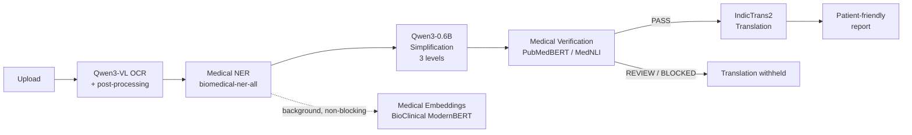

# Medical Term Simplifier – Technical Project Documentation

Prepared: 2026-08-10
Repository: `E:\Internships\Icebrkr\Medical-Term-Simplifier`
Production source boundary: `New_current/`
Primary internal sources: `ARCHITECTURE.md`, `ROADMAP.md`, `AGENTS.md`, `MODEL_MANIFEST.md`, `IMPLEMENTATION_LOG.md` (all repository-maintained, dated documents)
Dating basis: this repository has no usable Git commit history; all dates and chronology in this document are reconstructed from repository documentation and file modification metadata, not from commit history or author metadata.

## 1. Executive Summary

The Medical Term Simplifier converts medical documents — laboratory reports, discharge summaries, prescriptions, radiology reports, and consultation notes — into medically faithful, patient-understandable explanations at three readability levels, with optional translation into Indian regional languages. The production implementation (`New_current/`) is built as a set of independently replaceable, provider-based FastAPI services following a strict architecture contract: every AI stage sits behind a versioned REST API, a provider interface, and a fail-closed model-approval manifest that prevents any unapproved or unverified model from loading. By 2026-08-09, five of the pipeline's core stages — OCR, Medical NER, Simplification, Translation, and Verification — had reached real, non-mocked inference against pinned production checkpoints, with measured latency and at least two documented cases of the system's safety guards correctly rejecting unsafe generated output. Database, cache, and background-job infrastructure exist as a complete, tested software layer, but live-service validation could not be performed because PostgreSQL, Redis, and Docker are not available on the development host. Entity Linking, Relation Extraction, and Text-to-Speech are deliberately deferred from the minimum viable product (MVP), each for a specific, documented reason. This document distinguishes implemented, tested, and researched work throughout; no component is described as production-approved or clinically validated unless the repository contains direct evidence for that claim.

## 2. Problem Statement

Medical documents use dense clinical terminology, abbreviations, and numeric values (dosages, lab reference ranges, units) that are difficult for patients to interpret correctly. Misreading a medication dose, a lab value's direction (high vs. low), or a negated finding ("no evidence of X") can lead a patient to a materially wrong understanding of their own health. A simplification system for this domain must therefore do more than paraphrase: it must preserve every clinically load-bearing fact exactly, make failures explicit rather than silent, and support patients who read at different literacy levels or in different languages.

## 3. Objectives

- **Simplification**: produce patient-readable explanations of medical documents.
- **Medical fidelity**: never drop, alter, or invent a clinical fact, value, unit, or negation.
- **Multiple readability levels**: Clinical (terminology retained, readability improved), General Public (plain English), and Child-Friendly (highly simplified).
- **Multilingual access**: translate simplified output into Indian regional languages without losing protected clinical values.
- **Reduced hallucination**: detect and block generated content not supported by the source document, and independently verify simplified output against the source using a natural-language-inference model.
- **Modular integration**: every stage is independently replaceable behind a provider interface, so a model can be swapped, benchmarked, or upgraded without redesigning the rest of the system.

## 4. Scope

### Currently implemented (with evidence)

OCR (Qwen3-VL), Medical NER (`biomedical-ner-all`), Simplification (Qwen3-0.6B, 3 levels), Translation (IndicTrans2), Verification (PubMedBERT/MedNLI, technically verified), a 17-table PostgreSQL schema with Alembic migration, a Redis cache adapter, Celery job queues, a versioned REST API layer, an internal Jinja2/Bootstrap engineering console, GPU-accelerated inference, and a durable engineering log/roadmap governance process.

### Architecturally complete but not runtime-active

Entity Linking (SciSpaCy + UMLS — licensed terminology not provisioned), Relation Extraction (BioLinkBERT — no fine-tuned relation-classification checkpoint available), Medical Embeddings (BioClinical ModernBERT — exact model identity not yet approved; no Qdrant retrieval layer built at all).

### Not implemented

Text-to-Speech (Kokoro TTS is the documented target; no code exists for it), Qdrant vector storage/retrieval, a patient-facing frontend (only an internal engineering console exists), live PostgreSQL/Redis/Docker deployment validation, and clinical/representative-corpus validation for any AI stage.

### Explicitly deferred by design decision, not by omission

Entity Linking, Relation Extraction, Verification, and TTS are excluded from the active MVP pipeline by an explicit architectural decision recorded in `ROADMAP.md` ("MVP delivery override"), while their APIs and provider boundaries remain registered and documented. This is a scope decision, not unfinished work being hidden.

## 5. System Architecture

The production system (`New_current/`) follows one dependency direction for every stage: `HTTP route → application service → provider interface → model/infrastructure adapter`. Routes never import a model library directly; only the concrete adapter does. This is enforced repository-wide via `AGENTS.md`.

### Currently active MVP pipeline (as orchestrated by `/engineering-demo`)



### Full target architecture (per `ARCHITECTURE.md` §3; components beyond the MVP overlay above are architecture-complete but not wired into the active flow)


Every stage in the target diagram exposes typed stage results, provenance, model version, confidence, and timing; optional stages must be explicit in the API response rather than silently skipped (`ARCHITECTURE.md` §3).

## 6. Repository Structure

```text
New_current/                      Production-oriented service (source of truth for "current state")
  app/
    ocr/                          OCR bounded context (api, application, domain, providers, postprocessing, infrastructure, observability)
    ner/                          Medical NER service
    entity_linking/                SciSpaCy + UMLS boundary (runtime not configured)
    relation_extraction/           BioLinkBERT boundary (runtime deferred)
    embeddings/                    BioClinical ModernBERT boundary (model identity not approved)
    simplification/                Qwen3-0.6B three-level service
    translation/                   IndicTrans2 service
    verification/                  PubMedBERT / MedNLI service
    clinical/                      Earlier clinical-entity/report processing helpers
    db/                            Async SQLAlchemy models, repositories, session/health
    infrastructure/                Redis cache, Celery app/tasks/worker, jobs API, runtime metrics
    static/, templates/            Internal Jinja2/Bootstrap engineering console assets
  benchmarks/                      Per-stage benchmark harnesses and evidence artifacts (ocr, ner, translation, clinical_performance)
  tests/                           118 collected tests across ocr, ner, entity_linking, embeddings, simplification, translation, infrastructure, e2e, and root-level suites
  migrations/                      Alembic configuration and the single-head 0001_initial_schema migration
  docker-compose.yml, Dockerfile   Container topology (api, postgres, redis, migrate, celery-worker, celery-beat)
  MODEL_MANIFEST.md (repo root)    Fail-closed inventory of every approved model identity/revision/license
ARCHITECTURE.md, ROADMAP.md, AGENTS.md, IMPLEMENTATION_LOG.md   Repository-root engineering governance documents

backend/                           Earlier (2026-07-06/07) full FastAPI staged pipeline — superseded, not production
pipeline testing/                  Earlier (2026-07-11) standalone CLI pipeline — superseded, not production
Evaluation/                        Earlier (2026-06-22/26) Qwen-vs-Granite comparison harness — research artifact
sft_data_pipeline/                 Synthetic instruction-tuning dataset generator (5,000-example corpus delivered)
medical_term_sft/                  QLoRA fine-tuning pipeline for Qwen3-4B (training run interrupted, no adapter produced)
```

## 7. Document Processing

Supported upload formats (per `MODEL_MANIFEST.md`/`ROADMAP.md` Phase 2 acceptance criteria and `New_current/app/ocr/providers/documents.py`): PDF, PNG, JPEG, TIFF (single- and multi-frame), BMP, WebP, and HEIC. Documents with a usable native digital text layer (most born-digital PDFs) take a fast path through PyMuPDF-based text extraction; documents without one (scanned or image-based) are routed to the Qwen3-VL OCR provider. Malformed, encrypted, decompression-bomb, and oversized uploads are rejected before model inference. The native-PDF fast path was added specifically to fix a real defect where digitally-native PDFs were unnecessarily rendered to images and run through the OCR vision model (~11.6 GB memory, multi-minute latency) — see `IMPLEMENTATION_LOG.md`, 2026-08-05.

## 8. OCR Module

- **Model**: Qwen3-VL-4B-Instruct, repository `Qwen/Qwen3-VL-4B-Instruct`, pinned revision `ebb281ec70b05090aa6165b016eac8ec08e71b17`, Apache-2.0 license, local cache `New_current/.model-cache/qwen3-vl` (`MODEL_MANIFEST.md`).
- **Provider architecture**: `BaseOCRProvider` interface, instance-scoped registry with entry-point discovery, environment-backed configuration, lifecycle-managed lazy loading (one model instance per worker, reused across requests).
- **Preprocessing**: conservative decoding with content-signature validation, encrypted/malformed/empty-PDF rejection, decompression-bomb handling, EXIF orientation correction, bounded image resizing, configurable PDF render DPI.
- **Decoding/inference**: batched OCR across PDF pages, PNG, JPEG, and multi-frame TIFF; page order and per-page metadata preserved; document type is inferred in the same generation call as the OCR text (a deliberate simplification from an earlier separate-classifier design).
- **Post-processing**: three deterministic stages — regex normalization, medical-abbreviation dictionary expansion, and bounded SymSpell spelling correction — each protecting numeric values, doses, units, negation, and known dictionary/capitalized tokens from unsafe correction. Idempotent: retried post-processing cannot recursively re-expand an already-expanded abbreviation.
- **Confidence**: measured mean probability of generated tokens (`mean_generated_token_probability`), explicitly marked with an uncalibrated calibration identity until benchmark calibration is completed.
- **GPU/CPU operation**: `device=auto` (CUDA when available, CPU otherwise); explicit `cuda`/`cpu` overrides fail closed rather than silently falling back. Measured real GPU speedup: 168.7 s → 17.2 s (9.8x) on a representative synthetic input, on an RTX 5050 Laptop GPU (8 GB).
- **API integration**: `POST /api/v1/ocr`, `GET /api/v1/ocr/{request_id}`, `GET /api/v1/ocr/status/{request_id}`, `GET /api/v1/ocr/recent`, `GET /api/v1/ocr/logs`, `GET /api/v1/ocr/models`, `GET /api/v1/ocr/health`, `DELETE /api/v1/ocr/{request_id}`, plus `GET /api/v1/health/live` and `GET /api/v1/health/ready`.
- **Statistics/timing**: OCR responses carry upload/read time, decode/render time (separated from model inference time), model-load time, and generated-token throughput.
- **Known limitations**: a representative de-identified clinical corpus with accuracy (CER/WER) thresholds has not yet been assembled; a full production-precision (FP32) configuration is not deployable on the available 8 GB development GPU (confirmed CUDA out-of-memory); a BF16/resolution sweep to find a deployable precision/resolution profile did not complete within its benchmark time budget on harder synthetic documents, so no production default was changed as a result.

## 9. Medical NER

- **Models benchmarked**: OpenMed Zero-Shot GLiNER (`OpenMed/OpenMed-ZeroShot-NER-Pathology-Medium-209M`), `d4data/biomedical-ner-all`, and `Kushtrim/ModernBERT-base-biomedical-ner`, all evaluated offline on the same synthetic, 15-entity-reference, four-record dataset.
- **Selected approach**: `d4data/biomedical-ner-all`, revision `015a4050c9ac99722e61c547aa9b4282bcbedc7f`, Apache-2.0, selected for the highest measured macro F1 (0.381250 vs. 0.170833 for ModernBERT and 0.083333 for GLiNER) and materially lower latency (22.65 ms mean vs. 56.29 ms and 114.43 ms respectively).
- **Entity types**: normalized to Disease, Symptom, Medication, Procedure, Anatomy, Laboratory Test, Measurement, and Medical Abbreviation, each with source-text offsets and measured token confidence.
- **Limitations**: the four-record synthetic benchmark set is explicitly documented as too small for final clinical acceptance; a live-checkpoint smoke test observed partial-span extraction on real clinical-style text (e.g. `"2 diabetes"` rather than `"type 2 diabetes"`), which is preserved as evidence rather than hidden. Representative clinical-corpus thresholds and confidence calibration remain open.
- **Output structure**: `POST /api/v1/ner` returns canonical entities with offsets, measured confidence, aggregate confidence method, calibration version, review state, latency, exact model/revision, device, and pipeline/schema versions (`AGENTS.md`'s AI-inference contract, applied consistently across every stage).

## 10. Entity Linking / Relations

- **Entity Linking**: SciSpaCy + UMLS Linker architecture is fully implemented (provider, registry, service, versioned API at `/api/v1/entity-linking`, engineering console). **Runtime is not configured** — the exact SciSpaCy version, language model, and licensed UMLS terminology release have not been approved or provisioned, so the readiness probe reports `not_configured` by design.
- **Relation Extraction**: `michiyasunaga/BioLinkBERT-base` backbone architecture is fully implemented, including the provider, registry, versioned API, and a dynamic label ontology read from the checkpoint rather than hard-coded. **Direct inspection of the cached checkpoint's `config.json` found it declares a base `BertModel` with no trained sequence-classification relation head.** The provider explicitly refuses to let Transformers initialize a random classification head (which would fabricate relation output), reporting health as `incompatible_artifact`. A fine-tuned relation-classification checkpoint with a named ontology and no-relation label is required before this stage can run.
- Neither stage is implemented in the sense of "producing real production output" — both are **implemented and unit-tested at the architecture/contract level only**, by design, per the project's own scope-discipline rule against adding runtime speculatively.

## 11. Medical Embeddings

- **Model**: BioClinical ModernBERT (target). Provider interface, registry, application service, lifecycle, health/readiness, and `POST /api/v1/embeddings` are implemented, using attention-mask mean pooling with optional L2 normalization.
- **Implementation state**: `not_configured` — the exact repository ID, immutable revision, and license have not been approved. No live model has been loaded and no vector quality/latency/CUDA evidence exists yet.
- **Retrieval usage**: none. Vectors are returned directly to the caller; there is no persistence, indexing, or retrieval layer.
- **MVP role**: per `ROADMAP.md`'s MVP override, embeddings are explicitly a background-only, non-blocking operation and must never gate the patient-facing simplification/translation flow — this was verified and, at one point, actively fixed when a frontend defect made embeddings block simplification (`IMPLEMENTATION_LOG.md`, 2026-08-09).

## 12. Medical Knowledge Retrieval

**Qdrant is not implemented.** No collection, indexing, or retrieval code exists anywhere in the repository. `ARCHITECTURE.md` designates Qdrant as the target vector database with per-tenant, per-embedding-model-versioned collections, but this remains entirely a target-state design, not delivered code. No SNOMED CT, ICD-10, MedlinePlus, PubMed, or DrugBank integration exists in the repository; these appear only as architectural intent in planning documents, not as implemented knowledge sources.

## 13. Simplification Engine

- **Model**: Qwen3-0.6B, repository `Qwen/Qwen3-0.6B`, pinned revision `c1899de289a04d12100db370d81485cdf75e47ca`, Apache-2.0.
- **Prompts**: externally versioned JSON prompt, `qwen-medical-simplification-v2`, at `New_current/app/simplification/prompts/medical_report_v2.json`; source text is delimited as untrusted data within the prompt.
- **Three readability levels**: Clinical, General Public, Child-Friendly, all generated in one deterministic inference call (greedy decoding, `do_sample=False`, fixed seed).
- **Inference**: process-wide model reuse (loaded once per worker, cached by path/device), `model.eval()` + `torch.inference_mode()`, CUDA autocast, BF16 selected automatically on the available GPU.
- **Batching**: not used for simplification itself (all three levels are produced in a single generation call by design — batching them separately would be slower per `QWEN_TARGETED_PERFORMANCE_REPORT.md`).
- **GPU support**: `device=auto`; measured real speedup 463.3 s → 135.4 s (3.4x) after CUDA enablement.
- **Response format**: each level includes source, simplified report, term explanations, important findings, clinician questions, measured fidelity confidence (a source-fact/entity preservation ratio, explicitly not a calibrated clinical probability), latency, immutable model revision, and review state.
- **Hallucination control**: a deterministic source-grounding guard rejects output that introduces a numeric value/unit not present in the source, or explains a term absent from source evidence. Verified functioning on real inference: a negated pneumonia/medication case passed with preservation score 1.0 on all three levels; a numeric HbA1c laboratory case was **correctly rejected** when the model introduced an unsupported number, and prompt hardening alone did not eliminate that failure mode — the guard, not the prompt, is what caught it.
- **Known limitation**: representative clinical faithfulness/readability benchmarking, especially for numeric/laboratory report types, remains open; Phase 9 is explicitly not marked complete in `ROADMAP.md` for this reason.

## 14. Training / Fine-Tuning

- **Dataset generation**: `sft_data_pipeline/generate_5000_dataset.py` produced a deterministic, template-based synthetic corpus of **5,000 examples** (verified line count), seeded (`20260731`), SHA-256-fingerprinted (`479b192a71cb9f5209fb122da5fa5be6f47123db868c3491621999e05e4eab13`).
- **Schema**: each record is a `messages` object with `system`/`user`/`assistant` turns; the assistant turn is a structured JSON object with `report`, `summary`, `simplification.{clinical,general,child}`, and `entities` fields.
- **Specialties/report types/lengths**: 16 medical specialties, 32 named conditions, 15 report types (333–334 examples each), and three difficulty tiers (Long/Medium/Short, ~1,666–1,667 each), per the manifest.
- **A separate live-LLM generation path** (calling OpenAI/OpenRouter/Claude APIs with strict schema validation and crash-safe checkpointing) was fully implemented but **has no run evidence** — it was not the path that produced the shipped 5,000-example corpus.
- **SFT/LoRA**: `medical_term_sft/` implements QLoRA fine-tuning of `Qwen/Qwen3-4B-Instruct-2507` — 4-bit NF4 double-quantization, LoRA rank 32 / alpha 64 / dropout 0.05 on `q_proj/k_proj/v_proj/o_proj`, assistant-only loss masking, TRL `SFTTrainer`, deterministic 80/10/10 split (4,000/500/500 examples, fingerprint-matched to the dataset above).
- **Training parameters used**: the 8GB-constrained profile (`configs/qwen3_8gb.yaml`) — max sequence length 2,048, 3 configured epochs, learning rate 2e-5, batch size 1 with gradient accumulation 16.
- **Output adapter**: **none produced.** `outputs/training_metrics.csv` shows training loss falling from 1.12 to 0.097 across 27 logged steps, reaching `epoch: 1.0` of the configured 3, with validation loss never recorded. `checkpoints/` contains only a TensorBoard event log — no `adapter_model.safetensors`, `latest.json`/`best.json` pointer, `evaluation_metrics.json`, or `predictions.json` exists anywhere in the directory.
- **Evaluation**: `evaluate.py` implements strict JSON-structure validation and a "Medical Fidelity Score," but no evaluation was ever run to completion against a trained checkpoint, because no checkpoint was saved.
- **Status**: the Qwen3 QLoRA/SFT training pipeline and its synthetic medical simplification dataset were developed; the dataset generation is **complete and verified**. Training was initiated and evaluated in progress, but **the final adapter training was not completed and no production adapter weights were delivered during the documented period**. This must not be represented as a delivered fine-tuned model in any downstream use of this documentation.

## 15. Medical Verification

- **Architecture**: local-only PubMedBERT/MedNLI provider, `pritamdeka/PubMedBERT-MNLI-MedNLI`, pinned revision `f1b6ce2e0d49f295b4cbcdc56c01b5fab6d068ab`, `BertForSequenceClassification`, explicit `config.json`-driven label mapping (0=contradiction, 1=entailment, 2=neutral) — the service never infers or reorders labels.
- **Implementation status**: **technically verified**. Real CUDA inference confirmed all three verdict classes behave correctly: clear entailment → `entailment`/PASS, contradiction → `contradiction`/BLOCKED, neutral → `neutral`/REVIEW; deterministic checks additionally catch numeric, dosage, unit, percentage, date, medication-frequency, negation, and laterality mismatches and correctly return BLOCKED.
- **Pipeline role**: wired into the internal engineering console between Simplification and Translation — BLOCKED and REVIEW outputs stop Translation from running.
- **Open gate**: the checkpoint's license is explicitly recorded as `PENDING_VERIFICATION`; production approval is pending on that check, independent of the technical validation already completed.

## 16. Translation

- **Provider**: IndicTrans2, repository `ai4bharat/indictrans2-en-indic-dist-200M`, pinned revision `173b94239f7c38886b2747b8d4a5db771a7e1232`, MIT license.
- **Integrity control**: the provider verifies the SHA-256 of the local `model.safetensors` artifact (`0039e4304e9889acc5c8350a193311d07aa5399b6d9fb0445e8fde19e3533bb5`) before every initialization and refuses to load `pytorch_model.bin` as a fallback.
- **Value preservation**: numeric values, units, and dates are protected using unique bracketed sentinels designed to survive supported Indic-script transliteration; inference fails closed if preservation cannot be proven.
- **Languages validated**: Hindi, Tamil, and Kannada, with real synthetic medical-text checks confirming exact retention of tested dosage, unit, blood-pressure, and date values.
- **Batching**: a real `translate_batch` path was added so all three simplification levels can be translated in a single model call.
- **Device**: `auto`, verified selecting CUDA on the development host; measured batch throughput 1.934 texts/s (initial validation) / 0.867 texts/s (approved-artifact benchmark, different run conditions — not directly comparable).
- **End-to-end evidence**: a real, no-mock OCR → NER → Simplification → Translation run completed in 22,185.073 ms total.
- **Open gate**: representative clinical translation-quality validation across every enabled language has not been performed.

## 17. Speech / Voice Layer

**Not implemented.** `ARCHITECTURE.md` and `MODEL_MANIFEST.md` designate Kokoro TTS as the target technology; `ROADMAP.md` Phase 12 status is `DEFERRED FOR MVP` with no code delivered. An earlier concept referred to as "Project Vaani" for runtime speech generation is documented in project history as having been considered and explicitly replaced by the Kokoro TTS direction; no runtime Vaani integration exists in this repository, and it must not be conflated with the current (also unimplemented) Kokoro TTS target. A `voice_profiles`/`voice_generations` database schema exists (per the original `DB.pdf` design) but has no corresponding API or service code.

## 18. API Architecture

All routes below were confirmed by direct source inspection of `New_current/app/**/*.py` (not merely documentation).

| Method | Route | Purpose |
|---|---|---|
| POST | `/api/v1/ocr` | Submit a document for OCR |
| GET | `/api/v1/ocr/{request_id}` | Retrieve an OCR result |
| GET | `/api/v1/ocr/status/{request_id}` | Poll OCR processing status |
| DELETE | `/api/v1/ocr/{request_id}` | Delete an OCR result |
| GET | `/api/v1/ocr/recent`, `/logs`, `/models`, `/health` | OCR observability/inventory |
| GET | `/api/v1/health/live`, `/api/v1/health/ready` | Liveness/readiness probes |
| POST | `/api/v1/ner` | Run medical entity recognition |
| GET | `/api/v1/ner/models`, `/health` | NER inventory/health |
| POST | `/api/v1/entity-linking` | Link entities to UMLS concepts (`not_configured` until licensed runtime is provisioned) |
| GET | `/api/v1/entity-linking/models`, `/health` | Entity Linking inventory/health |
| POST | `/api/v1/relation-extraction` | Extract relations (`incompatible_artifact` until a fine-tuned checkpoint is supplied) |
| GET | `/api/v1/relation-extraction/models`, `/health` | Relation Extraction inventory/health |
| POST | `/api/v1/embeddings` | Generate medical text embeddings (`not_configured` until model identity is approved) |
| GET | `/api/v1/embeddings/models`, `/health` | Embeddings inventory/health |
| POST | `/api/v1/simplify` | Three-level simplification |
| POST | `/api/v1/simplifications` | Deprecated single-output compatibility route |
| GET | `/api/v1/simplify/models`, `/health` | Simplification inventory/health |
| POST | `/api/v1/translations` | Translate simplified text |
| GET | `/api/v1/translations/models`, `/health` | Translation inventory/health |
| POST | `/api/v1/verification` | Verify a simplification against its source |
| GET | `/api/v1/verification/models`, `/health` | Verification inventory/health |
| POST | `/api/v1/jobs` | Submit a durable background job |
| GET | `/api/v1/jobs`, `/api/v1/jobs/{job_id}` | List/retrieve jobs |
| DELETE | `/api/v1/jobs/{job_id}` | Cancel a job |
| GET | `/api/v1/infrastructure/health` | Database/Redis/Celery health |
| GET | `/api/v1/runtime/metrics` | Real GPU/CPU process metrics per stage |

**Not implemented despite being listed in `ARCHITECTURE.md` §6 as target routes**: `POST /api/v1/reports` (and its `GET`/`DELETE` sub-resources) and `POST /api/v1/speech`. Neither exists anywhere in `New_current/app/`. `PRODUCTION_DEPLOYMENT.md` describes a related but different `/reports` design that was not carried into the current implementation.

Eight additional internal, non-API routes (`/`, `/ner`, `/entity-linking`, `/embeddings`, `/simplify`, `/verification`, `/engineering-demo`, `/infrastructure`) serve the internal Jinja2/Bootstrap engineering console and are explicitly excluded from the OpenAPI schema (`include_in_schema=False`) — they are not the patient-facing product.

## 19. Data Models / Schemas

Every stage response follows the shared "AI inference contract" defined in `AGENTS.md`: `request_id`, durable processing identifier, exact `model_name`/immutable revision, `confidence` + `confidence_method` (+ calibration version where calibrated), `processing_time_ms`, `cache_hit`, pipeline/provider/prompt/schema versions, and an explicit review/failure state. Request/response models are typed Pydantic schemas per module (e.g. `New_current/app/ocr/api/schemas.py`, `app/ner/schemas.py`, `app/simplification/schemas.py`, `app/translation/schemas.py`, `app/verification/schemas.py`), each with OpenAPI examples and a stable error envelope (`code`, safe `message`, `request_id`).

## 20. Database Architecture

- **PostgreSQL** via async SQLAlchemy 2.x: 17 tables, confirmed by direct inspection of `New_current/app/db/models.py` and the matching single-head Alembic migration `New_current/migrations/versions/0001_initial_schema.py`. Eleven tables (`users`, `reports`, `report_processing`, `medical_entities`, `simplifications`, `model_outputs`, `feedback`, `voice_profiles`, `voice_generations`, `supported_dialects`, `user_preferences`) reproduce the original `DB.pdf` schema exactly; six are additive (`entity_links`, `embedding_records`, `translations`, `processing_jobs`, `audit_logs`, `model_registry`), added because the requested modules could not be implemented against the original schema alone.
- All 17 tables use UUID primary keys and shared timestamp/version columns; soft deletion is limited to appropriate user-visible aggregates. Binary report content, audio, and raw embedding vectors are explicitly **not** stored in PostgreSQL — only object-storage references.
- **Redis**: an encrypted JSON cache adapter with tenant/document-hash/stage/model/prompt/schema-versioned key identity, configurable TTL, and token-safe single-flight locking — implemented, not yet live-validated.
- **Qdrant / pgvector**: **not implemented.** No vector storage integration of any kind exists in the codebase.
- **Live validation status**: **not performed.** No PostgreSQL, Redis, or Docker executable is available on the development host; only offline Alembic DDL generation and fake/SQLite-backed repository tests have been exercised. This is an explicit, documented gap, not an oversight.

## 21. Background Processing

Celery is implemented with dedicated CPU and GPU queues and named task entry points for OCR, NER, Entity Linking, Embeddings, Simplification, and Translation. Jobs commit to PostgreSQL before broker submission so acknowledged work is durable even across broker failures; a Celery Beat task resubmits broker-failed jobs after recovery. Retries use exponential backoff with late acknowledgement and worker-loss rejection. `POST/GET /api/v1/jobs` and `DELETE /api/v1/jobs/{job_id}` expose job state. **The frozen AI service packages do not yet publish their six deployment entry points into the Celery task registry** — a missing stage binding fails closed rather than fabricating a task result. Live worker-restart/retry/recovery behavior has not been validated (no live broker available).

## 22. GPU / Runtime Architecture

- **Device resolution**: every model-backed provider resolves `device=auto` → CUDA if available, else CPU; an explicit `cuda` override on a host without CUDA support fails loudly rather than silently downgrading (a repository-wide, deliberately enforced policy).
- **CUDA enablement history**: the development host has a physical NVIDIA GeForce RTX 5050 Laptop GPU (8 GB, driver 592.27, CUDA 13.1-capable, compute capability 12.0/Blackwell), but the initially installed PyTorch build (`2.13.0+cpu`) had no CUDA support at all. This was diagnosed and fixed on 2026-08-09 by installing `torch==2.11.0+cu128`.
- **Precision**: BF16 selected automatically where supported (OCR, Simplification), with FP16 as fallback on CUDA and FP32 on CPU.
- **Memory**: a full-precision (FP32) OCR configuration causes CUDA out-of-memory on this 8 GB GPU; BF16 was confirmed as the lower-load-time, lower-memory candidate (BF16 init 24,058.935 ms / 8,519.605 MiB vs. FP16 28,244.485 ms / same allocation).
- **Model loading**: every model-backed provider loads its checkpoint once per worker process and reuses it across requests (verified for OCR, NER, Simplification, Translation, Verification); Simplification additionally caches by `(path, device)` key.

## 23. Performance Optimization

| Stage | CPU baseline | GPU (after CUDA enablement) | Speedup | Evidence |
|---|---:|---:|---:|---|
| OCR (Qwen3-VL-4B, synthetic PNG) | 168.7 s | 17.2 s | 9.8x | `IMPLEMENTATION_LOG.md`, 2026-08-09 |
| NER (biomedical-ner-all, 1 paragraph) | 1.30 s | 0.77 s | 1.7x | same |
| Simplification (Qwen3-0.6B, 3 levels) | 463.3 s | 135.4 s | 3.4x | same |
| Translation (IndicTrans2) | n/a | not runtime-testable at time of this measurement | — | same |

Measured real end-to-end warm-path latency (`PERFORMANCE_PROFILE.md`, 2026-08-09, real no-mock flow, CUDA): OCR + post-processing 7,123.953 ms, NER 27.964 ms, Simplification 14,264.999 ms, Verification 6.635–367.517 ms, Translation 768.157 ms, **total 22,185.073 ms**. Simplification (~64%) and OCR (~32%) are the dominant latency contributors; NER and Verification are not material single-request bottlenecks. An earlier, architecturally superseded GLiNER+Qwen3-0.6B composition separately reported a 20.0% latency reduction from context-window reduction and a 71.9% reduction from generation-parameter tuning (`PERFORMANCE_OPTIMIZATION.md`, `QWEN_PROFILING.md`) — retained as historical evidence only, since that service composition is not present in the current `app/main.py`.

No quantization or reduced generation-length change has been adopted in production, because no comparable clinical-fidelity benchmark has established that doing so is safe (`PERFORMANCE_PROFILE.md`).

## 24. Testing Strategy

- **Unit/integration/API tests**: 118 tests collected cleanly (`pytest --collect-only -q`, 0 errors) across `New_current/tests/`, spanning OCR (10 files), NER (3), Entity Linking (3), Embeddings (3), Simplification (2), Translation (2), Infrastructure (4), end-to-end (2), and 9 root-level cross-cutting suites (clinical extraction, clinical-performance harness, engineering demo, MVP workflow, OCR output contract, PDF de-identification adapter, performance optimization).
- **Model inference tests**: real (non-mocked) live-checkpoint smoke tests exist and were run for OCR, NER, Simplification, Translation, and Verification, each with measured latency/confidence evidence recorded in `IMPLEMENTATION_LOG.md`.
- **Benchmark runs**: per-stage benchmark harnesses under `New_current/benchmarks/` (ocr, ner, translation, clinical_performance), each producing JSON/CSV/Markdown evidence artifacts.
- **GPU / CPU fallback tests**: a CUDA-conditional test exists in the suite and correctly transitioned from "skipped" (no CUDA available) to "passing" once a CUDA-enabled PyTorch build was installed.
- **Sample document tests**: synthetic, de-identified fixtures only, per `AGENTS.md`'s rule against using real patient data in tests; a 50-document synthetic PHI dataset (`pdf_deid_synthetic_medical_v1`) exists for OCR benchmarking.
- **Test count progression**: 70 → 82 → 42 (post-legacy-removal) → 54 → 58 → 64 → 70 → 72 → 74 → 75 → 84 → 86 → 95 → 109 → 117 tests, tracked chronologically across the 2026-08-02 to 2026-08-09 period (full table in `TECHNICAL_IMPLEMENTATION_TIMELINE.md`).

## 25. Error Handling

Every provider defines typed, safe exceptions mapped to stable API error envelopes (`code`, safe `message`, `request_id`) — no stack trace or raw clinical content is ever returned to a client. Low-confidence OCR, unresolved NER entities, `not_configured` stages (Entity Linking, Embeddings), `incompatible_artifact` states (Relation Extraction), and BLOCKED/REVIEW verification results are all explicit, typed states rather than silent failures or fabricated success responses — this is a repository-wide rule (`AGENTS.md`: "Never ship placeholder implementations... do not silently fall back from a configured clinical model to heuristics or fabricated data"). Confidence thresholds gate manual-review routing for OCR and drive the BLOCKED/REVIEW/PASS verdicts for Verification.

## 26. Configuration

All model identity, revisions, licenses, and cache paths are governed by root-level `MODEL_MANIFEST.md`, a machine-readable, fail-closed manifest. `PENDING_APPROVAL` is a hard block, never a default or "latest" substitute. Deployment overrides are supplied through documented environment variables (e.g. `OCR_CONFIG__MODEL_NAME`, `OCR_CONFIG__MODEL_REVISION`, `NER_CONFIG__DEVICE`, `SIMPLIFICATION_CONFIG__MODEL_ID`, `TRANSLATION_CONFIG__MODEL_ID`) — an override must exactly match the manifest's approved identity; it cannot substitute an unapproved model. No secrets, API keys, or credentials are present in any configuration file reviewed for this documentation, and none are reproduced in this documentation set. Legacy evaluation code was identified (`Evaluation/test.py`, outside the `New_current/` production boundary) containing hardcoded credential handling — a plaintext API token — and should be migrated to environment-variable/secret-based configuration and rotated; this is an action item for the repository owner, not something this documentation pass modified.

## 27. Docker / Deployment

`New_current/Dockerfile`: `python:3.12-slim` base image, non-root `ibhealth` user, installs via `pip install .` from `pyproject.toml`, runs `uvicorn app.main:app` on port 8000. `New_current/docker-compose.yml` defines six services: `postgres` (16.4-alpine, health-checked), `redis` (7.4-alpine, password-protected, health-checked), `migrate` (one-shot `alembic upgrade head`), `api`, `celery-worker` (CPU/GPU queues, concurrency 1), and `celery-beat`. All four app-derived services share required environment variables using Compose's hard-fail `:?required` syntax so a missing configuration value fails deployment rather than silently defaulting. **This Compose topology has not been run to a live, converged state** — no Docker CLI is available on the development host, so this remains software-complete but deployment-unvalidated.

## 28. Security and Privacy Considerations

- All AI inference runs local-only (`local_files_only=True` / equivalent); no clinical document content is sent to a third-party model API in the production `New_current/` path.
- Structured logs explicitly exclude raw clinical text, prompts, and simplified output by repository-wide rule (`AGENTS.md`, `ARCHITECTURE.md` §9); logs carry request ID, stage, latency, model name/version, confidence, and safe resource metrics only.
- PHI/PHI-adjacent test data is synthetic or de-identified only; a dedicated PDF de-identification synthetic benchmark dataset exists for OCR testing.
- Tenant/document identity uses SHA-256 content hashing; cache keys never expose hashes as public identifiers.
- **HIPAA/GDPR compliance is not claimed anywhere in this documentation** and no formal compliance review artifact exists in the repository.
- Access control/authorization enforcement is designed at the platform boundary per `ARCHITECTURE.md` §6 but has not been implemented or tested in this repository (no authentication code was found in `New_current/app/`).
- Legacy evaluation code containing hardcoded credential handling was found in an out-of-production-scope research script (`Evaluation/test.py`) during this review; see Section 26 for the recommended remediation.

## 29. Licensing

| Model | License | Source |
|---|---|---|
| Qwen3-VL-4B-Instruct (OCR) | Apache-2.0 | `MODEL_MANIFEST.md` |
| `d4data/biomedical-ner-all` (NER) | Apache-2.0 | `MODEL_MANIFEST.md` |
| `michiyasunaga/BioLinkBERT-base` (Relation Extraction backbone) | Apache-2.0 | `MODEL_MANIFEST.md` |
| Qwen3-0.6B (Simplification) | Apache-2.0 | `MODEL_MANIFEST.md` |
| IndicTrans2 (Translation) | MIT | `MODEL_MANIFEST.md` |
| `pritamdeka/PubMedBERT-MNLI-MedNLI` (Verification) | `PENDING_VERIFICATION` | `MODEL_MANIFEST.md` |
| SciSpaCy + UMLS (Entity Linking) | `PENDING_APPROVAL`; UMLS carries its own license/access agreement | `MODEL_MANIFEST.md` |
| BioClinical ModernBERT (Embeddings) | `PENDING_APPROVAL` | `MODEL_MANIFEST.md` |

Apache-2.0 compatibility was an explicit, recorded selection criterion across the project (e.g. the OCR, NER, Relation Extraction, and Simplification model choices are all Apache-2.0). The Verification and Entity Linking candidates are explicitly held back from production approval specifically because their licensing has not yet been confirmed.

## 30. Known Limitations

- No representative, de-identified clinical corpus with accuracy thresholds exists yet for OCR, NER, Simplification, or Translation — all four stages are model-validated on synthetic/limited samples only, not clinically validated.
- OCR handwriting/scanned-document accuracy is unmeasured; a full-precision production configuration is not deployable on the available 8 GB development GPU, and no lower-precision/resolution profile has yet been confirmed both fast enough and accurate enough to deploy.
- Medical NER entity coverage is incomplete on real clinical-style text (documented partial-span extraction example); the four-record benchmark set is too small for clinical acceptance.
- Simplification's source-grounding guard is proven to work (it rejected a real unsafe output) but has not yet been validated as complete across all report types, particularly numeric/laboratory content.
- Entity Linking and Relation Extraction have no runtime evidence at all — both are licensing/checkpoint-blocked by design.
- Medical Embeddings has no approved model identity and no retrieval layer (Qdrant unimplemented).
- Verification's checkpoint license is unverified; production approval is pending independent of its technical validation.
- Database, Redis, and Celery infrastructure has never been exercised against live services (no PostgreSQL/Redis/Docker on the development host).
- Translation quality has not been clinically validated for any of the three tested languages.
- Resource constraints (single 8 GB development GPU, Windows WDDM driver overhead on small models) materially affect measured performance and are documented rather than hidden.

## 31. Future Work

Directly sourced from `ROADMAP.md`'s recorded open gates as of 2026-08-09:

- Complete representative clinical-corpus accuracy/threshold validation for OCR, NER, Simplification, and Translation.
- Obtain licensed UMLS access and approve the exact SciSpaCy artifact identity to activate Entity Linking.
- Obtain or train a fine-tuned Relation Extraction checkpoint with a named ontology and no-relation label.
- Approve the exact BioClinical ModernBERT identity and implement Qdrant vector storage/retrieval.
- Resolve the Verification checkpoint's license and obtain production approval.
- Perform live PostgreSQL, Redis, and Docker Compose validation once a compatible host/service environment is available.
- Implement Phase 12 (Kokoro TTS) and Phase 13 (durable end-to-end orchestration with checkpoint/resume/cancellation).
- Complete Phase 14 (benchmarking and production hardening): load/soak/concurrency testing, security/dependency scanning, disaster-recovery runbooks, and formal production release approval.

## 32. Current Project Status

| Component | Current State | Validation | Notes |
|---|---|---|---|
| Repository governance (`ARCHITECTURE.md`/`ROADMAP.md`/`AGENTS.md`/`IMPLEMENTATION_LOG.md`) | Completed | Documentation review | Phase 1, `COMPLETE` |
| OCR | Implemented | Local + live-checkpoint inference tested (confidence 0.9999 on test input) | Phase 2, `IN PROGRESS`; representative clinical-corpus benchmark still open |
| OCR post-processing (regex / abbreviation dictionary / SymSpell) | Implemented | Unit-tested; measured on synthetic fixtures (13 corrections in 0.472 ms) | Idempotent by design |
| Medical NER | Implemented | Real-checkpoint smoke-tested (49.021 ms, confidence 0.872816 on a live sample) | Phase 5, Stage 3 complete; clinical-corpus thresholds still open; 4-record benchmark set too small for clinical acceptance |
| Entity Linking | Architecture complete | Unit-tested at contract level only; no real-model runtime evidence | Phase 6, `DEFERRED FOR MVP`; blocked on UMLS licensing, not code |
| Relation Extraction | Architecture complete | Unit-tested at contract level only; checkpoint-integrity guard verified | Phase 7, `DEFERRED FOR MVP`; blocked on a missing fine-tuned checkpoint |
| Medical Embeddings | Architecture complete | Unit-tested at contract level only; no real-model runtime evidence | Phase 8, `IN PROGRESS - MVP BACKGROUND ONLY`; model identity not approved; no Qdrant retrieval layer |
| Simplification | Implemented | Real inference tested, including one real safety-guard rejection case | Phase 9, `IN PROGRESS - CLINICAL VALIDATION OPEN` |
| Verification | Technically verified | Real CUDA inference tested across all 4 verdict classes | Phase 10, `TECHNICALLY VERIFIED; LICENSE PENDING`; production approval pending on license only |
| Translation | Implemented | Real inference tested across 3 languages + a real end-to-end run | Phase 11, `IN PROGRESS - E2E RUNTIME VALIDATED`; clinical translation-quality validation still open |
| PostgreSQL / Alembic | Software implemented | Offline DDL generation + fake/SQLite-backed tests only | Phase 3, `IN PROGRESS - SOFTWARE IMPLEMENTED`; no live PostgreSQL available on the development host |
| Redis | Software implemented | Fake-backed tests only | Phase 4, `IN PROGRESS - SOFTWARE IMPLEMENTED`; no live Redis available on the development host |
| Celery | Software implemented | Fake-backed tests only | Phase 4, `IN PROGRESS - SOFTWARE IMPLEMENTED`; 6 AI-stage task entry points not yet published to the registry |
| Qdrant | Not implemented / planned | — | No code exists; target architecture only per `ARCHITECTURE.md` |
| Docker / Compose topology | Defined | Not run to a live converged state | No Docker CLI on the development host |
| GPU acceleration | Implemented | Measured (9.8x OCR, 3.4x Simplification, 1.7x NER speedup) | `IMPLEMENTATION_LOG.md`, 2026-08-09 |
| Synthetic SFT dataset (5,000 examples) | Completed | Verified 5,000 lines, SHA-256 matched | `sft_data_pipeline/` |
| Fine-tuning (QLoRA) | Pipeline developed | Training initiated; not completed | No final adapter weights delivered; `medical_term_sft/checkpoints/` contains no adapter files |
| Text-to-Speech | Planned | — | Kokoro TTS is the documented target; no code exists |
| End-to-End Pipeline (MVP slice) | Implemented for the MVP path | Real end-to-end run completed (22,185.073 ms) | Phase 13, `IN PROGRESS - MVP PATIENT WORKFLOW`; durable orchestration (checkpoint/resume/cancel) not yet built |
| Benchmarking / Production hardening | Harness scaffolded | Not populated with representative data | Phase 14, `PLANNED` |
| Internal engineering console | Implemented | Tested | `/engineering-demo`; not the patient-facing product |
| Patient-facing frontend | Not implemented | — | Only an internal console exists |

## 33. Conclusion

The Medical Term Simplifier has a working, GPU-accelerated core pipeline covering OCR, medical entity recognition, three-level simplification, translation, and technical (though not yet license-cleared) verification, each built behind a consistent, fail-closed, provider-based architecture with a durable engineering-governance process. Five stages have real, measured, non-mocked inference evidence against pinned production checkpoints, including two documented cases of the system's own safety guards correctly rejecting unsafe generated output. Database and background-job infrastructure exist as a complete, tested software layer awaiting a live deployment environment for final validation. Entity Linking, Relation Extraction, and Text-to-Speech remain deliberately unactivated pending specific, named prerequisites (licensing and a fine-tuned checkpoint) rather than being represented as complete. No claim of clinical validation, production deployment, or regulatory compliance is made anywhere in this documentation; those remain the explicitly recorded next steps in the project's own roadmap.
